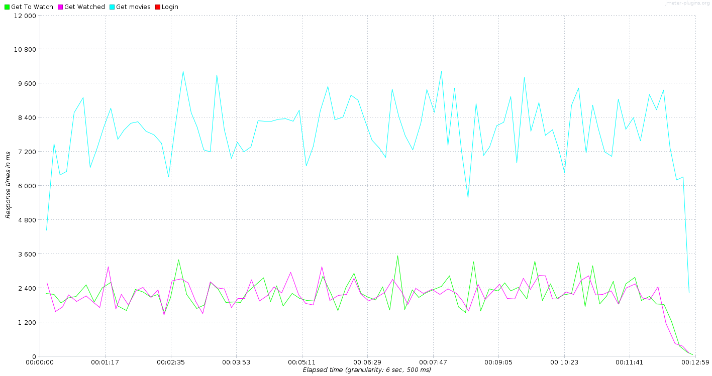
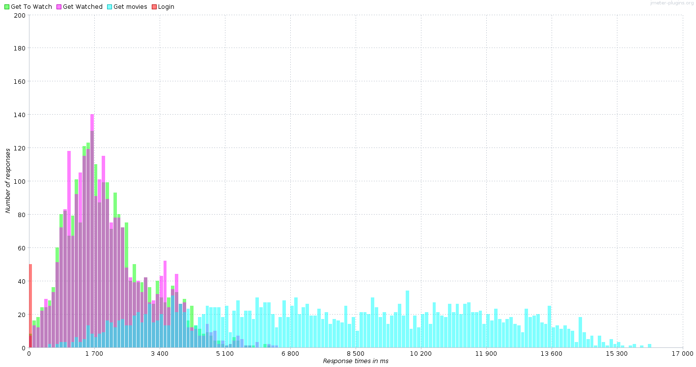
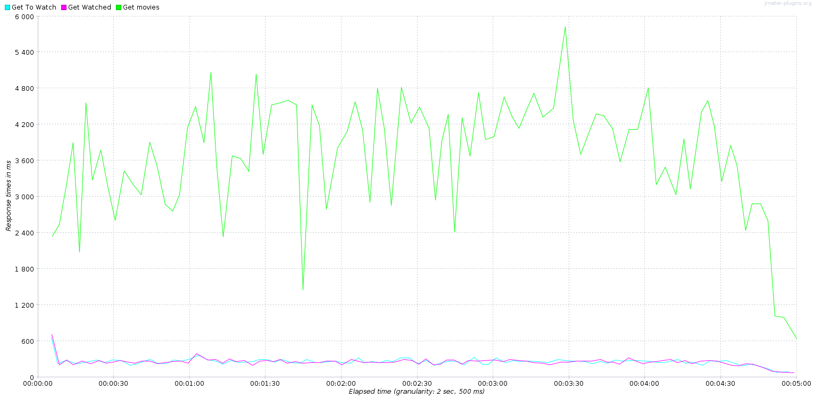

[Retour](../README.md)

# Perfomances

Les performances de charge de l'application, ou sa capacité à résister à un grand nombre de requêtes distinctes ont été évaluées par nos soins à l'aide de l'application JMeter.

## Ronde de test

Une ronde de test correspond à une itération de test pour un thread.
Cela correspond, en d'autres termes, à une suite d'actions qu'un utilisateur pourrait être amené à faire lors d'une session.

Une ronde sera ensuite effectuée 50 fois afin d'encenser davantage la moyenne produite.

### Choix

Pour ce compte rendu, nous avons choisi d'utiliser une ronde de tests simpliste,
se contentant de se connecter à l'application (login), d'accéder (dans un ordre choisi aléatoirement à chaque ronde) à trois ressources.

À noter que le `login` n'est effectué qu'une seule fois, à la première itération, et que le `logout` n'est jamais effectué.
La raison à cela est que nous avons également effectué des tests disposant de caractéristiques plus réaliste à ce sujet, mais les résultats relatifs à ces requêtes étant absolument insignifiants, nous avons pris le parti de simplifier la ronde.

## 50 threads

Le premier test de charge que nous vous présentons représente 50 utilisateurs fictifs, effectuant chacun 50 rondes décrites ci-dessus, tout en attendant un délai aléatoire de l'ordre de la seconde avant de passer à la ronde suivante.

Le graphique ci-dessous représente les temps de réponse additionnés, par requête, moyennés par thread, sur toute la durée du test (limitation à 100pts pour plus de visibilité) :

Ces graphiques montrent que le serveur d'application n'arrive clairement pas à suivre la demande avec des temps de réponse très élevés atteignant la dizaine de secondes parfois.
Ces temps ne sont pas étonnants, car l'infrastructure tourne en docker sur un laptop, il ne faut pas prendre à la lettre ces tests.
Nous pouvons tous de même voir que la page `get movies` est clairement deux fois plus longue à calculer que les pages `get watched` et `get toWatch`.
Cela ne nous semble peu étonnant, car nous travaillons avec un ensemble de données bien plus grandes dans ce cas et ainsi que les informations ajoutées sont faites par une jointure très certainement lourde.
Ensuite, nous pouvons constater que les pages `get watched` et `get toWatch` est confondu ce qui est logique, car ces deux pages sont très similaires.

Sur le graphe suivant, nous pouvons plus facilement voir la répartition des temps de calcul des différentes pages (ensemble des données sans limitation) :

## 20 threads

Le second test de charge effectué est passablement similaire au premier.
La première différence réside dans le nombre d'utilisateurs simultanés à effectuer des requêtes, qui passe donc de 50 a 20, dans le but de décharger un peu la machine de test.
La seconde différence n'est autre que l'attente entre deux rondes, qui est réduite de moitié, soit de l'ordre de la demi-seconde.

Nous obtenons ainsi un panel plus léger, mais légèrement plus agressif.

Voici le même premier graphique qu'au point précédant pour le test courant :

Comme nous pouvons l'observer, une nette amélioration des performances se profile, de l'ordre d'un facteur deux.

## Remarque générale

Si ces tests ont été très intéressants à mettre en place, ils ne s'avèrent pas très intéressants à effectuer sur une machine de type laptop.
Ceci pour la simple raison que les performances disponibles varient passablement sur la durée, et que le matériel n'est en aucun point optimisé pour ce genre de tâche.

Il est donc difficile d'accorder beaucoup de légitimité aux tests de charge dans un tel contexte, même si, encore une fois, l'élaboration d'une stratégie permettant de représenter un certain cas d'utilisation d'une application est aussi importante que ludique.
Cela aide également à la compréhension des défis majeurs rencontré§s par une telle application en production.

Toutefois, il a permis de mettre en valeur le coup que nous avons lors du calcul de la page `get movies` qui semble trop lourde actuellement et deviendra très certainement inutilisable avec le temps.
Il sera donc nécessaire d'améliorer la requête SQL effectués.

[Retour](../README.md)
